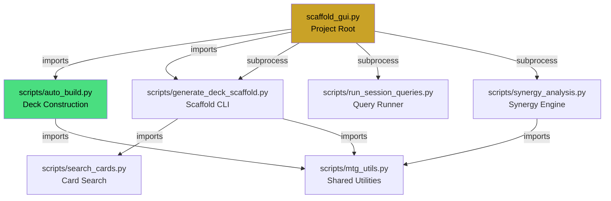
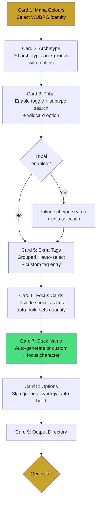

# GUI Overhaul Architecture Plan

> **Scope:** [`scaffold_gui.py`](scripts/scaffold_gui.py) (2029 lines) + [`generate_deck_scaffold.py`](scripts/generate_deck_scaffold.py) (1402 lines)
> **Goal:** Address 6 user observations, relocate file, extract auto-build logic, and modernize the form layout.

---

## Table of Contents

1. [Current State Analysis](#1-current-state-analysis)
2. [New Form Layout Order](#2-new-form-layout-order)
3. [Observation 1 — Deck Name Last + Auto-generate](#3-observation-1--deck-name-last--auto-generate)
4. [Observation 2 — Archetype Redesign](#4-observation-2--archetype-redesign)
5. [Observation 3 — Tribal as Standalone Section](#5-observation-3--tribal-as-standalone-section)
6. [Observation 4 — Creature Subtype UI Fix](#6-observation-4--creature-subtype-ui-fix)
7. [Observation 5 — Extra Tags Auto-select + Custom Tags](#7-observation-5--extra-tags-auto-select--custom-tags)
8. [Observation 6 — Focus Cards Quantity Removal](#8-observation-6--focus-cards-quantity-removal)
9. [File Relocation Strategy](#9-file-relocation-strategy)
10. [Auto-build Logic Extraction](#10-auto-build-logic-extraction)
11. [Module Dependency Diagram](#11-module-dependency-diagram)
12. [New Form Flow Diagram](#12-new-form-flow-diagram)
13. [Implementation Phases](#13-implementation-phases)
14. [Settings Migration](#14-settings-migration)
15. [Testing Strategy](#15-testing-strategy)

---

## 1. Current State Analysis

### File: [`scaffold_gui.py`](scripts/scaffold_gui.py) — 2029 lines

| Section | Lines | Description |
|---------|-------|-------------|
| Constants + palette | 1–120 | Colors, archetype groups, tags, Karsten table |
| [`RunResult`](scripts/scaffold_gui.py:124) dataclass | 124–133 | Result container for background tasks |
| Pure helpers | 136–420 | `normalize_colors`, `filter_tribes`, land analysis, pip counting |
| CSV sorting + merging | 422–488 | `sort_and_rewrite_csv`, `merge_scores_into_candidate_pool` |
| **Auto-build** | 490–1060 | `auto_build_decklist` — ~570 lines of deck construction logic |
| Font + widget helpers | 1062–1117 | `_init_fonts`, `w_entry`, `w_button`, `w_check`, `w_label` |
| [`ScaffoldApp`](scripts/scaffold_gui.py:1121) class | 1121–2027 | The main application class |

### Current Form Card Order (New Scaffold tab)

| Card # | Title | Widget | Lines |
|--------|-------|--------|-------|
| 1 | Deck Name | Text entry | 1285–1289 |
| 2 | Mana Colours | 5 toggle buttons WUBRG | 1290–1292 |
| 3 | Archetype | 31 archetypes in 7 groups, flat toggle grid | 1293–1295 |
| 4 | Creature Subtype | Search + results + chips, disabled unless tribal | 1296–1298 |
| 5 | Extra Tags | 18 tags in 6-column flat grid | 1299–1301 |
| 6 | Focus Cards | Textbox, one per line, hint says "LOCKED 4x" | 1302–1309 |
| 7 | Options | 4 checkboxes | 1310–1312 |
| 8 | Output Directory | Entry + Browse button | 1313–1315 |

### Current Archetype Groups ([`ARCHETYPE_GROUPS`](scripts/scaffold_gui.py:72))

```
Aggro:            aggro, burn, prowess, infect
Tempo / Midrange: midrange, tempo, blink, lifegain, tribal
Control / Prison: control, stax, superfriends
Combo:            combo, storm, extra_turns
Graveyard:        graveyard, reanimation, flashback, madness, self_mill, opp_mill
Permanents:       tokens, aristocrats, enchantress, equipment, artifacts, vehicles, voltron
Ramp / Big Mana:  ramp, landfall, lands, domain, eldrazi, energy, proliferate
```

**Problems identified:**
- `tribal` buried in "Tempo / Midrange" — makes no sense thematically
- `lifegain` in "Tempo / Midrange" — debatable but acceptable
- No descriptions/tooltips on any archetype
- No validation that archetype queries actually return relevant cards

---

## 2. New Form Layout Order

The form cards are reordered to match the natural deck-building thought process: *What colors? → What strategy? → What tribe? → What tags? → What specific cards? → What name? → Options → Go.*

| New # | Title | Was Card # | Key Changes |
|-------|-------|------------|-------------|
| 1 | **Mana Colours** | 2 | No change to widget, just moved to first position |
| 2 | **Archetype** | 3 | Redesigned groups, tooltips, `tribal` removed from here |
| 3 | **Tribal** | 4 (partial) | Standalone card, always visible, integrated subtype search |
| 4 | **Creature Subtype** | 4 (partial) | Compact redesign, only shown when Tribal is active |
| 5 | **Extra Tags** | 5 | Grouped by category + auto-select button + custom tag entry |
| 6 | **Focus Cards** | 6 | Remove "4x" language, change to "include this card" semantics |
| 7 | **Deck Name** | 1 | Moved to end, auto-generate checkbox + focus character field |
| 8 | **Options** | 7 | No major changes |
| 9 | **Output Directory** | 8 | No change |

> **Rationale:** Deck Name moves last because it depends on colors + archetype for auto-generation. Colors come first because they constrain everything else.

---

## 3. Observation 1 — Deck Name Last + Auto-generate

### Current State
- Card 1 in the form ([`_build_scaffold_tab`](scripts/scaffold_gui.py:1279), line 1285)
- Simple text entry with placeholder `"e.g. Orzhov Lifegain"`
- Validation requires non-empty name as step 1 ([`_validate_live`](scripts/scaffold_gui.py:1678))

### New Design

**Card 7: Deck Name** — now the second-to-last card before Options.

```
┌─────────────────────────────────────────────────────┐
│ 7  Deck Name                                        │
│                                                     │
│ [x] Auto-generate from Colors + Archetype           │
│                                                     │
│ Preview:  "Orzhov Lifegain"                         │
│                                                     │
│ Focus Character (optional): [___Aerith___________]  │
│                                                     │
│ Preview:  "Orzhov Lifegain — Aerith"                │
│                                                     │
│ [ ] Custom name override                            │
│ [_________________________________] (disabled when  │
│                                      auto-generate) │
└─────────────────────────────────────────────────────┘
```

### Implementation Details

**Auto-generate name logic** — new function `generate_deck_name()`:

```python
# Color pair → guild name mapping
GUILD_NAMES = {
    "WU": "Azorius", "WB": "Orzhov", "WR": "Boros", "WG": "Selesnya",
    "UB": "Dimir",   "UR": "Izzet",  "UG": "Simic",
    "BR": "Rakdos",  "BG": "Golgari",
    "RG": "Gruul",
    # Shards / Wedges
    "WUB": "Esper",  "WUR": "Jeskai", "WUG": "Bant",
    "WBR": "Mardu",  "WBG": "Abzan",  "WRG": "Naya",
    "UBR": "Grixis", "UBG": "Sultai", "URG": "Temur",
    "BRG": "Jund",
    # 4-color / 5-color
    "WUBRG": "Five-Color",
    # Mono
    "W": "Mono-White", "U": "Mono-Blue", "B": "Mono-Black",
    "R": "Mono-Red",   "G": "Mono-Green",
}

def generate_deck_name(colors: str, archetypes: list[str],
                       focus_char: str = "") -> str:
    color_name = GUILD_NAMES.get(colors, colors)
    # Pick primary archetype — first selected, or highest-priority
    arch_label = archetypes[0].replace("_", " ").title() if archetypes else ""
    base = f"{color_name} {arch_label}".strip()
    if focus_char:
        base += f" — {focus_char}"
    return base
```

**Validation change:** When auto-generate is on, skip the "enter a deck name" validation step. The name is computed on-the-fly from colors + archetype selections.

**Settings export/import:** Add `"auto_name": true/false` and `"focus_character": "..."` fields.

---

## 4. Observation 2 — Archetype Redesign

### Current Problems
1. 31 archetypes in 7 groups with no descriptions
2. `tribal` is in "Tempo / Midrange" — wrong category
3. Landfall bug: [`ARCHETYPE_QUERIES["landfall"]`](scripts/generate_deck_scaffold.py:288) queries look correct (uses `--oracle landfall` and `--oracle "whenever a land enters the battlefield under your control"`), but the issue may be that **color filtering** in [`run_query()`](scripts/generate_deck_scaffold.py:395) injects `--colors` which limits results. Need to verify `search_cards.py` handles oracle+color intersection correctly.

### New Archetype Groups (30 archetypes — `tribal` removed to its own section)

```python
ARCHETYPE_GROUPS = {
    "Aggro": {
        "aggro":    "Fast creatures + cheap removal. Win by turn 5.",
        "burn":     "Direct damage spells to face and creatures.",
        "prowess":  "Noncreature spell triggers on creatures.",
        "infect":   "Poison counters — 10 = win. Pump spells.",
    },
    "Midrange": {
        "midrange":  "Value creatures + flexible answers. Grind advantage.",
        "tempo":     "Cheap threats + bounce/counter to stay ahead.",
        "blink":     "Flicker creatures for repeated ETB triggers.",
        "lifegain":  "Life gain triggers + payoff creatures.",
    },
    "Control": {
        "control":      "Counters + removal + late-game finishers.",
        "stax":         "Tax and denial effects. Lock opponents out.",
        "superfriends": "Planeswalker-heavy strategy.",
    },
    "Combo": {
        "combo":       "Assemble specific card combinations to win.",
        "storm":       "Chain spells for storm count payoffs.",
        "extra_turns": "Take additional turns to close the game.",
    },
    "Graveyard": {
        "graveyard":   "Cards-in-graveyard payoffs: Delve, Threshold.",
        "reanimation": "Put big creatures in graveyard, return to play.",
        "flashback":   "Cast spells from graveyard: Flashback, Escape.",
        "madness":     "Discard triggers + Madness cost casting.",
        "self_mill":   "Fill your own graveyard for synergy.",
        "opp_mill":    "Mill opponent's library as win condition.",
    },
    "Permanents": {
        "tokens":      "Create token creatures + anthem effects.",
        "aristocrats":  "Sacrifice creatures for death triggers.",
        "enchantress": "Enchantment-cast triggers + constellation.",
        "equipment":   "Equipment cards + equipped-creature payoffs.",
        "artifacts":   "Artifact ETB/count payoffs: Affinity, Metalcraft.",
        "vehicles":    "Crew vehicles + creature synergy.",
        "voltron":     "Stack auras/equipment on one creature to win.",
    },
    "Ramp / Lands": {
        "ramp":        "Accelerate mana to cast big threats early.",
        "landfall":    "Land-enters-battlefield triggers.",
        "lands":       "Land recursion + graveyard land play.",
        "domain":      "Basic land type count payoffs.",
        "eldrazi":     "Colorless Eldrazi creatures + Annihilator.",
        "energy":      "Energy counter generation + spending.",
        "proliferate": "Add counters via Proliferate mechanic.",
    },
}
```

### Tooltip Implementation

Each archetype button gets a hover tooltip showing the description string. Use a lightweight tooltip class:

```python
class Tooltip:
    def __init__(self, widget, text):
        self.widget = widget
        self.text = text
        self.tip = None
        widget.bind("<Enter>", self.show)
        widget.bind("<Leave>", self.hide)
```

### Archetype Query Validation

A new validation script `scripts/validate_archetype_queries.py` should:

1. Iterate every key in [`ARCHETYPE_QUERIES`](scripts/generate_deck_scaffold.py:113)
2. Run each query against the local card database
3. Report which queries return 0 results
4. Flag queries where the label mentions a mechanic but the results don't contain that mechanic in oracle text
5. Specifically test `landfall` queries with color filtering to reproduce the reported bug

This is a **separate task** from the GUI overhaul but should be done in parallel.

---

## 5. Observation 3 — Tribal as Standalone Section

### Current State
- `tribal` is one of 31 archetype toggles in the "Tempo / Midrange" group ([`ARCHETYPE_GROUPS`](scripts/scaffold_gui.py:74))
- When `tribal` is toggled on, Card 4 "Creature Subtype" becomes enabled ([`_toggle_arch`](scripts/scaffold_gui.py:1384))
- The subtype card is always visible but disabled — wastes space

### New Design

**Card 3: Tribal** — standalone card, always visible, with its own enable toggle.

```
┌─────────────────────────────────────────────────────┐
│ 3  Tribal                                           │
│                                                     │
│ [x] Enable Tribal                                   │
│                                                     │
│ Search: [___Frog________________]                   │
│ ┌─────────────────────────────────────────────┐     │
│ │ ✓ Frog    Angel    Elf    Goblin    Human   │     │
│ │   Dragon  Merfolk  Zombie  Vampire  Knight  │     │
│ └─────────────────────────────────────────────┘     │
│                                                     │
│ Selected: [Frog ×]                                  │
│                                                     │
│ [x] Wildcard (tribe as hint only)                   │
└─────────────────────────────────────────────────────┘
```

### Implementation Details

- Remove `"tribal"` from `ARCHETYPE_GROUPS` entirely
- Remove `"tribal"` from `ALL_TAGS` (it is currently in both places)
- Create a new `_build_tribal_card()` method that combines:
  - Enable/disable toggle (replaces the archetype button)
  - Creature subtype search (moved from old Card 4)
  - Wildcard checkbox (moved from Options card)
- When tribal is enabled, it adds `"tribal"` to the archetype list sent to the CLI
- The subtype search area is **inline** — no separate card needed
- Move the `wildcard_var` checkbox into this card since it only applies to tribal

---

## 6. Observation 4 — Creature Subtype UI Fix

### Current Problem
- [`_build_tribe()`](scripts/scaffold_gui.py:1394) creates: search entry → results frame → chips frame
- The results frame ([`_tribe_results`](scripts/scaffold_gui.py:1399)) is always packed with `fill="x"` even when empty
- The chips frame ([`_tribe_chips`](scripts/scaffold_gui.py:1401)) is always packed even when empty
- This creates a large blank area

### New Design — Compact Inline Layout

1. **Search entry** — always visible when tribal is enabled
2. **Results dropdown** — use a floating overlay or collapsible frame that only appears during active search, disappears when search is cleared
3. **Chips row** — use `wraplength` and only pack when chips exist; hide when empty
4. **Minimum height** — set `height=0` on the results frame when empty; let it grow only when populated

```python
def _build_tribal_section(self, parent):
    # Search entry
    self._tribe_search_entry = w_entry(parent, "Search creature types...")
    self._tribe_search_entry.pack(fill="x", padx=INNER_PAD, pady=(0, 4))

    # Results — initially hidden
    self._tribe_results = ctk.CTkFrame(parent, fg_color=SURFACE,
                                        corner_radius=8, height=0)
    # Do NOT pack until search produces results

    # Chips — initially hidden
    self._tribe_chips = ctk.CTkFrame(parent, fg_color="transparent")
    # Do NOT pack until chips exist

def _tribe_search(self):
    # ... search logic ...
    if matches:
        self._tribe_results.pack(fill="x", padx=INNER_PAD, pady=(0, 4))
        # populate buttons
    else:
        self._tribe_results.pack_forget()

def _refresh_tribe_chips(self):
    if self._tribes:
        self._tribe_chips.pack(fill="x", padx=INNER_PAD, pady=(4, 14))
        # populate chips
    else:
        self._tribe_chips.pack_forget()
```

This eliminates the blank space problem entirely — sections only appear when they have content.

---

## 7. Observation 5 — Extra Tags Auto-select + Custom Tags

### Current State
- 18 tags in a flat 6-column grid ([`ALL_TAGS`](scripts/scaffold_gui.py:88))
- No grouping, no descriptions, no auto-selection
- Tags: `lifegain, removal, draw, counter, ramp, haste, flying, trample, mill, wipe, pump, bounce, etb, tutor, flash, tribal, protection, deathtouch`

### New Design

**Card 5: Extra Tags** — grouped by category with auto-select and custom tag entry.

```
┌─────────────────────────────────────────────────────┐
│ 5  Extra Tags          [Auto-select from Archetype] │
│                                                     │
│ Offensive:  [haste] [trample] [flying] [pump]       │
│             [deathtouch] [infect]                    │
│                                                     │
│ Defensive:  [lifegain] [protection] [flash]         │
│             [counter] [wipe]                         │
│                                                     │
│ Utility:    [removal] [draw] [ramp] [bounce]        │
│             [etb] [tutor] [mill]                     │
│                                                     │
│ Custom:     [____________] [+ Add]                  │
│             [mounts ×] [lessons ×]                   │
└─────────────────────────────────────────────────────┘
```

### Tag Categories

```python
TAG_CATEGORIES = {
    "Offensive": ["haste", "trample", "flying", "pump", "deathtouch"],
    "Defensive": ["lifegain", "protection", "flash", "counter", "wipe"],
    "Utility":   ["removal", "draw", "ramp", "bounce", "etb", "tutor", "mill"],
}
```

> Note: `tribal` is removed from tags — it is now handled by the Tribal card.

### Auto-select Mapping

```python
ARCHETYPE_TAG_MAP = {
    "aggro":       {"haste", "pump", "trample", "removal"},
    "burn":        {"removal", "haste"},
    "prowess":     {"draw", "pump", "haste"},
    "infect":      {"pump", "trample", "protection"},
    "midrange":    {"removal", "draw"},
    "tempo":       {"bounce", "counter", "flash", "draw"},
    "blink":       {"etb", "bounce", "draw"},
    "lifegain":    {"lifegain", "draw", "protection"},
    "control":     {"counter", "removal", "wipe", "draw"},
    "stax":        {"counter", "protection"},
    "superfriends":{"removal", "wipe", "draw"},
    "combo":       {"tutor", "draw", "protection"},
    "storm":       {"draw", "ramp"},
    "extra_turns": {"draw", "counter"},
    "graveyard":   {"mill", "draw"},
    "reanimation": {"mill", "tutor", "etb"},
    "flashback":   {"mill", "draw"},
    "madness":     {"draw"},
    "self_mill":   {"mill", "draw"},
    "opp_mill":    {"mill", "counter"},
    "tokens":      {"pump", "draw"},
    "aristocrats": {"etb", "draw", "removal"},
    "enchantress": {"draw", "etb"},
    "equipment":   {"pump", "protection"},
    "artifacts":   {"ramp", "draw"},
    "vehicles":    {"haste", "pump"},
    "voltron":     {"pump", "protection", "trample"},
    "ramp":        {"ramp", "draw"},
    "landfall":    {"ramp", "draw"},
    "lands":       {"ramp"},
    "domain":      {"ramp"},
    "eldrazi":     {"ramp"},
    "energy":      {"draw"},
    "proliferate": {"draw"},
}
```

### Auto-select Button Behavior

1. Click "Auto-select from Archetype"
2. Union all tags from `ARCHETYPE_TAG_MAP` for each selected archetype
3. Toggle those tags ON (additive — does not clear existing selections)
4. Visual flash animation on newly-selected tags

### Custom Tags

- Free-text entry field + "Add" button
- Custom tags appear as removable chips below the entry
- Custom tags are passed to `--extra-tags` alongside the standard tags
- Stored in settings as `"custom_tags": ["mounts", "lessons"]`

---

## 8. Observation 6 — Focus Cards Quantity Removal

### Current State
- [`_build_scaffold_tab`](scripts/scaffold_gui.py:1302) line 1304: hint text says `"One per line. LOCKED 4x into mainboard (3x if Legendary). Fuzzy-matched."`
- [`auto_build_decklist`](scripts/scaffold_gui.py:493) line 534–542: `_copies_for()` returns `3 if leg else 4` when `is_focus=True`
- [`_copy_reason`](scripts/scaffold_gui.py:544) line 549: returns `"Focus (locked 4x)"`
- Phase 1 comment at line 557: `"PHASE 1: Lock focus cards — 4x default, Legendary 3x"`

### New Design

**Focus cards = "include this card"** — the auto-build determines optimal quantity.

Changes required:

1. **Hint text** → `"One per line. Fuzzy-matched. Auto-build determines optimal copy count based on CMC, rarity, and synergy score."`

2. **[`_copies_for()`](scripts/scaffold_gui.py:534)** — remove the `is_focus` parameter override:
   ```python
   def _copies_for(r):
       cmc = _safe_float(r.get("cmc", "0"))
       leg = "Legendary" in r.get("type_line", "")
       if cmc >= 6:        return 1
       if cmc >= 5 or leg: return 2
       if cmc >= 4:        return 3
       return 4
   ```

3. **Phase 1 logic** — focus cards still get priority placement but use the same `_copies_for()` as regular cards. The "focus" aspect means they are **guaranteed inclusion** regardless of synergy score, not that they get a fixed quantity.

4. **[`_copy_reason()`](scripts/scaffold_gui.py:544)** — update:
   ```python
   def _copy_reason(r, copies, *, is_focus=False):
       parts = []
       if is_focus:
           parts.append("Focus")
       if "Legendary" in r.get("type_line", "") and copies <= 2:
           parts.append("Legendary")
       cmc = _safe_float(r.get("cmc", "0"))
       if cmc >= 5:
           parts.append("CMC %d" % int(cmc))
       return " + ".join(parts) if parts else ""
   ```

5. **Log messages** — update focus log to say `"✓ CardName -> 2x (Focus + Legendary)"` instead of `"Focus (locked 4x)"`

---

## 9. File Relocation Strategy

### Current Location
- [`scripts/scaffold_gui.py`](scripts/scaffold_gui.py) — treated as a utility script

### New Location
- `scaffold_gui.py` at project root — user-facing application

### Migration Steps

1. **Move file:** `scripts/scaffold_gui.py` → `scaffold_gui.py`
2. **Update path resolution:** The current [`_scripts_dir`](scripts/scaffold_gui.py:30) resolves to `Path(__file__).resolve().parent`. After moving to root, this needs to point to `scripts/`:
   ```python
   _scripts_dir = Path(__file__).resolve().parent / "scripts"
   ```
3. **Update imports:** The `sys.path.insert` at line 31 must point to `scripts/`:
   ```python
   sys.path.insert(0, str(_scripts_dir))
   ```
4. **Update [`RepoPaths`](scripts/scaffold_gui.py:37):** Already uses `root=` auto-detection, should work from project root.
5. **Update documentation:** [`README.md`](README.md), [`scripts/README.md`](scripts/README.md), [`LOCAL_WORKFLOW.md`](LOCAL_WORKFLOW.md)
6. **Update any CI/scripts** that reference `scripts/scaffold_gui.py`

### Risk Assessment
- **Low risk** — the GUI is a standalone entry point, not imported by other modules
- The `_scripts_dir` variable is used to locate `generate_deck_scaffold.py`, `run_session_queries.py`, and `synergy_analysis.py` — all remain in `scripts/`

---

## 10. Auto-build Logic Extraction

### Current State
- [`auto_build_decklist()`](scripts/scaffold_gui.py:493) spans lines 490–1060 (~570 lines)
- Includes: land analysis, Karsten mana base, focus card resolution, scoring, deck assembly
- Helper functions embedded: `_is_land_card`, `_card_type_group`, `_resolve_card_name`, `_detect_land_colors`, `_enters_tapped`, `_land_is_acceptable`, `_land_has_dead_tribal`, `_count_pips`, `_karsten_required`
- CSV utilities: `sort_and_rewrite_csv`, `merge_scores_into_candidate_pool`

### New Module: `scripts/auto_build.py`

Extract all auto-build logic into a standalone module:

```
scripts/auto_build.py
├── Constants
│   ├── SCORE_SORT_KEYS
│   ├── _KARSTEN table
│   ├── BASIC_FOR_COLOR / SUBTYPE_COLOR
│   └── TAP_ALWAYS / TAP_CONDITIONAL
├── Land Analysis
│   ├── _detect_land_colors()
│   ├── _enters_tapped()
│   ├── _land_is_acceptable()
│   └── _land_has_dead_tribal()
├── Card Utilities
│   ├── _is_land_card()
│   ├── _card_type_group()
│   ├── _resolve_card_name()
│   ├── _copies_for()
│   ├── _copy_reason()
│   ├── _count_pips()
│   └── _karsten_required()
├── CSV Utilities
│   ├── sort_and_rewrite_csv()
│   └── merge_scores_into_candidate_pool()
└── Main Entry
    └── auto_build_decklist()
```

### GUI Changes After Extraction

The GUI imports from the new module:

```python
from auto_build import (
    auto_build_decklist,
    sort_and_rewrite_csv,
    merge_scores_into_candidate_pool,
    SCORE_SORT_KEYS,
)
```

The GUI retains only:
- UI constants (palette, fonts)
- Widget helpers
- `ScaffoldApp` class
- Color constants used for log coloring (passed as parameters to auto-build)

### Estimated Line Reduction

| Component | Before | After |
|-----------|--------|-------|
| `scaffold_gui.py` | 2029 | ~1200 |
| `scripts/auto_build.py` | 0 | ~650 |
| Net new lines | — | ~-180 (dedup) |

---

## 11. Module Dependency Diagram



---

## 12. New Form Flow Diagram



---

## 13. Implementation Phases

### Phase 1: Extract + Relocate (Foundation) ✅

- [x] Create `scripts/auto_build.py` — move all auto-build logic out of GUI
  - Move lines 97–120 (constants: `SCORE_SORT_KEYS`, `_KARSTEN`, `BASIC_FOR_COLOR`, `SUBTYPE_COLOR`, tap constants)
  - Move lines 136–420 (pure helpers: land analysis, card utilities, pip counting)
  - Move lines 422–488 (CSV utilities: `sort_and_rewrite_csv`, `merge_scores_into_candidate_pool`)
  - Move lines 490–1060 (`auto_build_decklist` and its inner functions)
  - Add proper module docstring and `__all__` exports
- [x] Update `scaffold_gui.py` to import from `scripts/auto_build.py`
- [x] Move `scripts/scaffold_gui.py` → `scaffold_gui.py` (project root)
- [x] Update `_scripts_dir` path resolution for new location
- [x] Verify all subprocess calls still resolve correctly
- [x] Run manual smoke test: generate a scaffold, confirm identical output

### Phase 2: Form Reorder + Deck Name (Observations 1, 6) ✅

- [x] Reorder form cards: Colors → Archetype → Tribal → Tags → Focus → Name → Options → Output
- [x] Add `GUILD_NAMES` mapping and `generate_deck_name()` function
- [x] Build new Deck Name card with auto-generate checkbox
- [x] Add Focus Character text field
- [x] Add live preview label that updates on color/archetype/character change
- [x] Add Custom Name Override toggle that disables auto-generate
- [x] Update `_validate_live()` to skip name check when auto-generate is on
- [x] Update Focus Cards hint text to remove "LOCKED 4x" language
- [x] Update `_copies_for()` to remove `is_focus` override — use same logic for all cards
- [x] Update `_copy_reason()` to show "Focus" as a tag, not "locked 4x"
- [x] Update settings export/import for new fields: `auto_name`, `focus_character`

### Phase 3: Archetype Redesign (Observation 2) ✅

- [x] Change `ARCHETYPE_GROUPS` from `dict[str, list]` to `dict[str, dict[str, str]]` (key → description)
- [x] Remove `tribal` from archetype groups
- [x] Rename "Tempo / Midrange" → "Midrange", "Control / Prison" → "Control", "Ramp / Big Mana" → "Ramp / Lands"
- [x] Implement `Tooltip` class for hover descriptions
- [x] Attach tooltip to each archetype button with its description text
- [x] Update `_build_archetypes()` to use new data structure
- [ ] Create `scripts/validate_archetype_queries.py` (separate task, can run in parallel)
  - Iterate all `ARCHETYPE_QUERIES` keys
  - Run each query against local database
  - Report 0-result queries
  - Test landfall specifically with color filtering

### Phase 4: Tribal Standalone + Subtype UI (Observations 3, 4) ✅

- [x] Create new `_build_tribal_card()` method
- [x] Add "Enable Tribal" checkbox toggle (replaces archetype button)
- [x] Move subtype search inline into tribal card
- [x] Move `wildcard_var` checkbox into tribal card
- [x] Implement show/hide for results frame — `pack_forget()` when empty
- [x] Implement show/hide for chips frame — `pack_forget()` when empty
- [x] Remove old Card 4 "Creature Subtype" as separate card
- [x] Update `_toggle_arch()` to no longer manage tribal enable/disable
- [x] Test: tribal enable → search → select → chips appear → disable → chips clear

### Phase 5: Extra Tags Overhaul (Observation 5) ✅

- [x] Define `TAG_CATEGORIES` dict (Offensive, Defensive, Utility)
- [x] Remove `tribal` from `ALL_TAGS`
- [x] Define `ARCHETYPE_TAG_MAP` for auto-select
- [x] Rebuild `_build_tags()` with category sub-headers and grouped layout
- [x] Add "Auto-select from Archetype" button in card header
- [x] Implement auto-select logic: union tags from selected archetypes, toggle ON
- [ ] Add custom tag entry field + "Add" button
- [ ] Add custom tag chip display with remove buttons
- [ ] Update `_on_generate()` to include custom tags in `--extra-tags`
- [ ] Update settings export/import for `custom_tags` list

### Phase 6: Polish + Documentation ✅

- [x] Update [`README.md`](README.md) with new GUI location and usage
- [x] Update [`scripts/README.md`](scripts/README.md) to note GUI moved to root
- [x] Update [`LOCAL_WORKFLOW.md`](LOCAL_WORKFLOW.md) with new launch command
- [x] Update [`Changelog.md`](Changelog.md) with all GUI overhaul changes
- [x] Final visual review of all form cards for spacing and alignment
- [x] Test save/load settings with new fields (backward compatibility)
- [x] Test auto-generate name with all color combinations
- [x] Test custom tags round-trip through generate → scaffold output

---

## 14. Settings Migration

### Current Settings Format ([`.scaffold.json`](scripts/scaffold_gui.py:117))

```json
{
    "deck_name": "Orzhov Lifegain",
    "colors": ["B", "W"],
    "archetypes": ["lifegain"],
    "tribes": [],
    "tags": ["draw", "lifegain"],
    "focus_cards": ["Ajani's Pridemate"],
    "output_dir": "Decks/",
    "options": {
        "skip_queries": false,
        "run_synergy": true,
        "auto_build": true,
        "wildcard": false
    }
}
```

### New Settings Format

```json
{
    "version": 2,
    "deck_name": "Orzhov Lifegain — Aerith",
    "auto_name": true,
    "focus_character": "Aerith",
    "colors": ["B", "W"],
    "archetypes": ["lifegain"],
    "tribal_enabled": true,
    "tribes": ["Angel"],
    "tags": ["draw", "lifegain"],
    "custom_tags": ["mounts", "lessons"],
    "focus_cards": ["Ajani's Pridemate"],
    "output_dir": "Decks/",
    "options": {
        "skip_queries": false,
        "run_synergy": true,
        "auto_build": true,
        "wildcard": false
    }
}
```

### Backward Compatibility

- If `"version"` key is missing, treat as v1 format
- v1 → v2 migration: `auto_name=false`, `focus_character=""`, `custom_tags=[]`, `tribal_enabled = "tribal" in archetypes`
- The `wildcard` option stays in `options` for CLI compatibility but the checkbox moves to the Tribal card visually

---

## 15. Testing Strategy

### Manual Smoke Tests

| Test | Expected Result |
|------|-----------------|
| Generate scaffold with auto-name | Folder name matches "GuildName Archetype" pattern |
| Generate with focus character | Name includes " — Character" suffix |
| Select landfall archetype | Candidate pool contains landfall-keyword cards |
| Enable tribal + select Frog | Subtype search works, chips appear, scaffold includes `--tribe Frog` |
| Auto-select tags for "control" | counter, removal, wipe, draw are toggled on |
| Add custom tag "mounts" | Tag appears in chips, passed to `--extra-tags` |
| Focus card "Sheoldred" | Auto-build uses CMC-based copies (2x for Legendary), not hardcoded 4x |
| Load v1 settings file | Migrates cleanly, no errors, form populates correctly |
| Save + reload settings | Round-trip preserves all new fields |

### Automated Tests

- Unit test `generate_deck_name()` with all guild/shard/wedge combinations
- Unit test `_copies_for()` with various CMC/Legendary combinations (no `is_focus` override)
- Unit test settings v1 → v2 migration
- Unit test `ARCHETYPE_TAG_MAP` coverage: every archetype key exists in the map
- Integration test: `auto_build.py` produces valid 60-card decklist from test corpus

### Regression Guards

- Existing test corpus scaffold ([`test-corpus/Esper.scaffold.json`](test-corpus/Esper.scaffold.json)) should still load
- Auto-build output format (decklist.txt) must remain unchanged
- CLI interface to `generate_deck_scaffold.py` is not modified — only the GUI changes