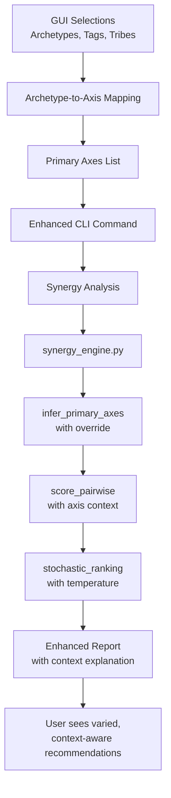

# Synergy Analysis GUI Integration Architecture

## Problem Statement
Users report that synergy analysis "chooses the same cards more often than not, regardless of selection from the GUI." The deterministic scoring algorithm produces identical rankings for identical input pools, and GUI selections (archetypes, tags, tribes) are not integrated into the scoring logic.

## Root Cause Analysis

### Current Flow
1. **GUI Selections** → Scaffold generation → `session.md` candidate pool
2. **Synergy Analysis** reads `session.md` → deterministic scoring → fixed ranking
3. **Missing Link**: GUI archetype/tag selections don't modify scoring parameters

### Technical Issues
1. **Primary Axis Inference**: `infer_primary_axes()` detects axes from card pool only
2. **Fixed Weights**: Composite score uses hardcoded weights in `CompositeWeights`
3. **Deterministic Ranking**: No variation or tie-breaking mechanism
4. **Parameter Isolation**: GUI doesn't pass archetype preferences to synergy analysis

## Design Goals

### Primary Objectives
1. **Context-Aware Scoring**: Incorporate user's archetype preferences into synergy evaluation
2. **Variation**: Introduce controlled randomness to prevent identical rankings
3. **Transparency**: Users should understand why certain cards are recommended
4. **Backward Compatibility**: Existing workflows must continue to work

### Secondary Objectives
1. **Weight Customization**: Allow users to adjust scoring priorities
2. **Multi-Archetype Support**: Handle decks with multiple archetypes
3. **Performance**: Minimal impact on analysis speed

## Architecture Design

### 1. Primary Axis Override System

#### Current Implementation
```python
# synergy_engine.py:276-306
def infer_primary_axes(profiles, override=""):
    if override:
        return {x.strip().lower() for x in override.split(",") if x.strip()}
    # Otherwise infer from pool
```

#### Enhancement: Archetype-to-Axis Mapping
Create a mapping from archetype names to primary mechanical axes:

```python
# New module: synergy_archetype_mapping.py
ARCHETYPE_TO_AXES = {
    "lifegain": {"lifegain"},
    "token": {"token"},
    "aristocrats": {"sacrifice", "token"},
    "blink": {"etb", "blink"},
    "storm": {"storm_count", "draw"},
    "enchantress": {"enchantress"},
    "graveyard": {"mill", "reanimation"},
    "ramp": {"ramp"},
    "control": {"removal", "counter", "wipe"},
    "aggro": {"haste", "pump", "trample"},
    # ... map all archetypes from ARCHETYPE_GROUPS
}
```

#### Integration Points
1. **GUI Layer**: Collect selected archetypes → map to axes → pass to synergy analysis
2. **CLI Layer**: Add `--primary-axes` parameter (comma-separated)
3. **Engine Layer**: Use provided axes instead of/in addition to inferred axes

### 2. GUI Parameter Passing Enhancement

#### Current GUI Command Construction
```python
# scaffold_gui.py:1348-1354
cmd = [sys.executable, str(_scripts_dir/"synergy_analysis.py"), inp]
if t and t != "3.0": cmd.extend(["--min-synergy", t])
m = self._syn_mode.currentText()
if m and m != "auto": cmd.extend(["--mode", m])
```

#### Enhanced Command Construction
```python
# Get selected archetypes from main scaffold tab
archetypes = self.selected_archetypes  # Set from scaffold tab
axes = archetype_to_axes(archetypes)   # Map to primary axes
if axes:
    cmd.extend(["--primary-axes", ",".join(sorted(axes))])

# Pass weight preferences if customized
if self._custom_weights:
    cmd.extend(["--weights-json", self._weights_file])
```

#### New GUI Elements
1. **Synergy Tab Additions**:
   - "Use archetype preferences" checkbox (default: checked)
   - "Primary axes override" multi-select dropdown
   - "Scoring weights" slider group (advanced section)

2. **Scaffold Tab Integration**:
   - Store selected archetypes for synergy analysis
   - Option: "Apply archetype preferences to synergy analysis"

### 3. Stochastic Ranking Enhancement

#### Problem: Deterministic Tie-Breaking
Cards with identical composite scores are ordered arbitrarily (Python's stable sort). Need controlled variation.

#### Solution: Probabilistic Ranking
```python
# synergy_report.py modification
def stochastic_ranking(scores, temperature=0.01):
    """Apply small random variation to composite scores."""
    ranked = []
    for name, score in scores.items():
        # Add Gaussian noise proportional to temperature
        noise = random.gauss(0, temperature * score.composite_score)
        adjusted = score.composite_score + noise
        ranked.append((name, score, adjusted))
    
    # Sort by adjusted score
    ranked.sort(key=lambda x: -x[2])
    return [(name, score) for name, score, _ in ranked]
```

#### Configuration
- **Temperature parameter**: `--ranking-temperature` (default: 0.01)
- **Seed for reproducibility**: `--ranking-seed`
- **GUI control**: "Variation" slider (0% = deterministic, 100% = high variation)

### 4. Weight Customization System

#### Current Fixed Weights
```python
# synergy_types.py:215-220
class CompositeWeights:
    engine_density: float = 40.0
    synergy_density: float = 25.0
    raw_interactions_cap: float = 20.0
    role_breadth: float = 3.0
    oracle_confirmed: float = 2.0
```

#### Enhanced Configurable Weights
```python
class CompositeWeights:
    # Base weights
    engine_density: float = 40.0
    synergy_density: float = 25.0
    raw_interactions_cap: float = 20.0
    role_breadth: float = 3.0
    oracle_confirmed: float = 2.0
    
    # Archetype-specific multipliers
    archetype_multipliers: Dict[str, float] = field(default_factory=dict)
    
    # Axis-specific bonuses
    axis_bonuses: Dict[str, float] = field(default_factory=dict)
```

#### Weight Profiles
Predefined profiles for different deck types:
- **"Engine-Focused"**: `engine_density=50.0, synergy_density=20.0`
- **"Synergy-Dense"**: `engine_density=30.0, synergy_density=40.0`
- **"Oracle-Priority"**: `oracle_confirmed=5.0`
- **"Role-Breadth"**: `role_breadth=5.0`

### 5. Candidate Pool Regeneration Workflow

#### Problem: Stale Session Data
Users change GUI selections but synergy analysis reads old `session.md`.

#### Solution: On-Demand Regeneration
```python
def regenerate_candidate_pool_if_needed(gui_state, session_path):
    """Regenerate candidate pool when archetype selections change."""
    state_hash = hash_gui_state(gui_state)
    cached_hash = read_cached_hash(session_path)
    
    if state_hash != cached_hash:
        # Regenerate using generate_deck_scaffold.py
        run_scaffold_generation(gui_state)
        write_cached_hash(session_path, state_hash)
```

#### Integration Options
1. **Automatic**: Always regenerate before synergy analysis
2. **Prompt**: Ask user if they want to regenerate
3. **Manual**: "Regenerate pool" button in synergy tab

## Implementation Phases

### Phase 1: Primary Axis Integration (Quick Win)
**Estimated Effort**: 2-3 files, minimal risk

1. **Add archetype-to-axis mapping** (`synergy_archetype_mapping.py`)
2. **Enhance CLI** with `--primary-axes` parameter
3. **Modify GUI** to pass archetype selections
4. **Update `infer_primary_axes()`** to respect override

### Phase 2: Stochastic Ranking (User-Visible Improvement)
**Estimated Effort**: 1-2 files, low risk

1. **Add temperature parameter** to CLI and GUI
2. **Implement `stochastic_ranking()`** in `synergy_report.py`
3. **Add random seed support** for reproducibility

### Phase 3: Weight Customization (Advanced Feature)
**Estimated Effort**: 3-4 files, moderate risk

1. **Make `CompositeWeights` configurable** via JSON
2. **Add weight profiles** and GUI controls
3. **Integrate with archetype preferences**

### Phase 4: Pool Regeneration (Completeness)
**Estimated Effort**: 2-3 files, moderate risk

1. **Add state tracking** to GUI
2. **Implement regeneration logic**
3. **Add UI feedback** (progress, success/failure)

## Data Flow Diagram



## API Changes

### CLI Interface Additions
```bash
# New parameters
--primary-axes "lifegain,token,sacrifice"  # Override inferred axes
--ranking-temperature 0.02                  # Add variation (0.0-0.1)
--ranking-seed 42                          # Reproducible variation
--weights-json path/to/weights.json        # Custom scoring weights
--regenerate-pool                          # Force pool regeneration
```

### Python API Changes
```python
# synergy_engine.py
def score_pairwise(
    cards_or_entries,
    score_mode="role-aware",
    primary_axis="",           # Existing
    primary_axes_override=None, # New: explicit axes list
    weights=None,              # New: CompositeWeights instance
    ranking_temperature=0.0,   # New: variation amount
) -> Dict[str, CardScore]:
```

## Backward Compatibility

### Guaranteed
1. Existing CLI calls without new parameters produce identical results
2. GUI synergy tab continues to work with default settings
3. All existing reports maintain same format

### Behavioral Changes (Opt-in)
1. New parameters only affect behavior when explicitly used
2. Default `ranking_temperature=0.0` maintains determinism
3. Default `primary_axes_override=None` uses existing inference

## Testing Strategy

### Unit Tests
1. **Archetype mapping**: Verify correct axis mapping
2. **Primary axis override**: Test `infer_primary_axes()` with override
3. **Stochastic ranking**: Verify ranking variation within bounds
4. **Weight customization**: Test composite score with custom weights

### Integration Tests
1. **GUI to CLI**: Verify parameter passing
2. **End-to-end**: Run synergy analysis with archetype preferences
3. **Regression**: Compare outputs with/without new features

### User Acceptance Tests
1. **Variation test**: Run same analysis multiple times, verify variation
2. **Context test**: Change archetype selections, verify different recommendations
3. **Performance test**: Ensure no significant slowdown

## Risk Assessment

### Low Risk
- Primary axis override (additive, doesn't break existing)
- Stochastic ranking (opt-in, controlled variation)

### Medium Risk
- Weight customization (changes scoring formula)
- GUI parameter passing (new UI elements)

### High Risk
- Candidate pool regeneration (modifies file system)
- Archetype mapping (potential incorrect mappings)

## Success Metrics

1. **User-reported bug resolution**: "Cards vary based on GUI selections"
2. **Increased recommendation relevance**: User satisfaction with suggested cards
3. **Maintained performance**: Analysis time within 10% of baseline
4. **Zero regression**: Existing workflows continue to work

## Next Steps

1. **Review this design** with stakeholders
2. **Implement Phase 1** (Primary Axis Integration)
3. **Test with real user scenarios**
4. **Iterate based on feedback**

---

*Last updated: 2026-04-17*  
*Author: Architect Mode*  
*Status: Design Complete*