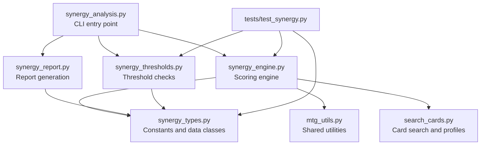
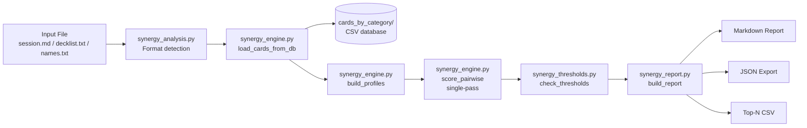

# Synergy Analysis Revamp — Architecture Plan

> **Status:** Draft  
> **Author:** Roo (Architect mode)  
> **Date:** 2026-04-13  

---

## Problem Statement

The current [`synergy_analysis.py`](scripts/synergy_analysis.py) is a 1,124-line monolith that handles:

1. Card name extraction from 4 input formats (session.md, decklist, pools, plain text)
2. Card data loading from the CSV database
3. Synergy profile computation (delegated to `search_cards.py`)
4. 5-pass pairwise scoring (tag matching, oracle cross-ref, oracle bridges, redundancy, dependency)
5. Role classification (engine / enabler / payoff / support / interaction)
6. Composite scoring with density-first weighting
7. Threshold calibration and checking (pool vs deck mode)
8. Full markdown report generation (scores table, oracle interactions, redundant pairs, chains, checklist)
9. Top-N CSV export
10. CLI argument parsing and orchestration

### Current Pain Points

| Area | Issue |
|------|-------|
| **Architecture** | Single file does everything — impossible to test individual passes in isolation |
| **Architecture** | `compute_synergy_profile` lives in `search_cards.py` (800 lines deep) — wrong home |
| **Architecture** | `CARD_TYPES` is duplicated across 6 files — should be in `mtg_utils.py` |
| **Architecture** | `compute_tags` exists in both `search_cards.py` (dict-based) and `mtg_utils.py` (string-based) — confusing dual API |
| **Performance** | O(n²) pairwise loop runs 5 separate passes over the same pairs — could be single-pass |
| **Performance** | Card DB lookup scans all CSVs sequentially with no index |
| **Scoring** | Oracle text cross-reference (Pass 2) uses raw regex on every pair — slow and fragile |
| **Scoring** | No weighting for interaction confidence (oracle-confirmed vs tag-inferred treated equally in raw score) |
| **Scoring** | Composite score formula has magic numbers with no tuning mechanism |
| **Reporting** | Markdown-only output — no structured data export (JSON) for downstream tools |
| **Reporting** | Synergy chains are auto-generated stubs — no real chain analysis |
| **Reporting** | No visual synergy matrix or role distribution chart |
| **Testing** | Zero unit tests — regressions are invisible |

---

## Proposed Architecture

### Module Decomposition



### File Responsibilities

| File | Responsibility | Approx Lines |
|------|---------------|:------------:|
| [`synergy_types.py`](scripts/synergy_types.py) | Data classes, constants, interaction rules, role tags, enums | ~200 |
| [`synergy_engine.py`](scripts/synergy_engine.py) | Card loading, profile building, single-pass pairwise scoring, composite calculation | ~400 |
| [`synergy_thresholds.py`](scripts/synergy_thresholds.py) | Threshold calibration, checking, pass/fail logic | ~150 |
| [`synergy_report.py`](scripts/synergy_report.py) | Markdown report, JSON export, optional HTML matrix | ~350 |
| [`synergy_analysis.py`](scripts/synergy_analysis.py) | CLI arg parsing, format detection, orchestration — thin wrapper | ~150 |
| [`tests/test_synergy.py`](tests/test_synergy.py) | Unit tests for engine, thresholds, types | ~300 |

---

## Phase 1: Extract Shared Constants and Types — `synergy_types.py`

### What moves here

- **`INTERACTION_RULES`** — the 30+ directional interaction rule tuples
- **`ROLE_TAGS`**, **`INTERACTION_TAGS`**, **`SUPPORT_TAGS`**, **`CORE_ENGINE_TAGS`** — role classification sets
- **`_ORACLE_KEYWORDS`** — keywords checked in oracle cross-reference
- **`_DEP_PATTERNS`** — dependency detection patterns
- **`_PAYOFF_BRIDGE_PATTERNS`** — oracle payoff bridge patterns
- **`InteractionType`** — enum replacing string literals: `FEEDS`, `TRIGGERS`, `ENABLES`, `AMPLIFIES`, `PROTECTS`, `REDUNDANT`
- **`CardRole`** — enum: `ENGINE`, `ENABLER`, `PAYOFF`, `SUPPORT`, `INTERACTION`
- **`SynergyProfile`** — dataclass replacing the current dict-of-sets
- **`CardScore`** — dataclass replacing the current score dict with 15+ keys
- **`ThresholdConfig`** — dataclass for threshold parameters

### New: `InteractionType` enum with weights

```python
class InteractionType(Enum):
    FEEDS     = "FEEDS"
    TRIGGERS  = "TRIGGERS"
    ENABLES   = "ENABLES"
    AMPLIFIES = "AMPLIFIES"
    PROTECTS  = "PROTECTS"
    REDUNDANT = "REDUNDANT"

INTERACTION_WEIGHTS: dict[InteractionType, float] = {
    InteractionType.FEEDS:     2.0,
    InteractionType.TRIGGERS:  2.0,
    InteractionType.ENABLES:   2.0,
    InteractionType.AMPLIFIES: 1.5,
    InteractionType.PROTECTS:  1.0,
    InteractionType.REDUNDANT: 0.0,
}
```

### New: `SynergyProfile` dataclass

Replaces the current `Dict[str, Any]` returned by `compute_synergy_profile`:

```python
@dataclass
class SynergyProfile:
    name: str
    broad_tags: frozenset[str]
    source_tags: frozenset[str]
    payoff_tags: frozenset[str]
    subtypes: frozenset[str]
    keywords: frozenset[str]
    cmc: float
    type_line: str
    oracle_text: str
    is_land: bool
```

### New: `CardScore` dataclass

Replaces the 15-key score dict:

```python
@dataclass
class CardScore:
    profile: SynergyProfile
    qty: int
    section: str  # main / side / pool
    role: CardRole
    synergy_partners: set[str]
    engine_partners: set[str]
    support_partners: set[str]
    role_breadth_types: set[InteractionType]
    dependency: int
    interactions: list[Interaction]
    redundant_with: list[str]
    weighted_synergy: float
    engine_synergy: float

    # Computed properties
    @property
    def synergy_count(self) -> int: ...
    @property
    def synergy_density(self) -> float: ...
    @property
    def engine_density(self) -> float: ...
    @property
    def composite_score(self) -> float: ...
```

### Consolidation: `CARD_TYPES` moves to `mtg_utils.py`

Currently duplicated in 6 files. Move the canonical definition to [`mtg_utils.py`](scripts/mtg_utils.py) and have all scripts import from there.

---

## Phase 2: Scoring Engine — `synergy_engine.py`

### Key Improvements

#### 2a. Single-pass pairwise scoring

The current code runs 5 separate nested loops over the same O(n²) pairs. The revamp merges all passes into a single iteration:

```python
for i, name_a in enumerate(names):
    for name_b in names[i + 1:]:
        # Pass 1: Tag matching
        _score_tag_interactions(pa, pb, ...)
        # Pass 2: Oracle cross-reference
        _score_oracle_crossref(pa, pb, ...)
        # Pass 2b: Oracle bridges
        _score_oracle_bridges(pa, pb, ...)
        # Pass 3: Redundancy
        _score_redundancy(pa, pb, ...)
# Pass 4 (dependency) remains per-card, not per-pair
```

This cuts iteration overhead by ~4x for large pools.

#### 2b. Pre-compiled oracle index

Instead of running regex on every pair, build an inverted index at profile-build time:

```python
# Built once per card
oracle_index = {
    "subtypes_mentioned": set(),   # subtypes found in oracle text
    "keywords_cared_about": set(), # keywords referenced in oracle text
    "bridge_matches": [],          # pre-matched payoff bridge patterns
}
```

Then pairwise oracle checks become set intersections instead of regex scans.

#### 2c. Confidence-weighted scoring

Replace the current binary oracle/tag distinction with a 3-tier confidence system:

| Confidence | Weight Multiplier | Source |
|-----------|:-----------------:|--------|
| `oracle`  | 1.5x | Verified against card text |
| `tag`     | 1.0x | Tag-pair rule match |
| `inferred`| 0.5x | Heuristic / broad-tag overlap |

#### 2d. Relocate `compute_synergy_profile`

Move from [`search_cards.py`](scripts/search_cards.py:800) to [`synergy_engine.py`](scripts/synergy_engine.py). The function is only used by synergy analysis — it does not belong in the search tool. `search_cards.py` keeps `compute_tags` (its own simpler version) and the `_DIRECTIONAL` patterns move to `synergy_types.py`.

#### 2e. Composite score formula — configurable weights

Replace magic numbers with a named config:

```python
@dataclass
class CompositeWeights:
    engine_density: float = 40.0
    synergy_density: float = 25.0
    raw_interactions_cap: float = 20.0
    role_breadth: float = 3.0
    oracle_confirmed: float = 2.0
    confidence_bonus: float = 1.5  # NEW: bonus for high-confidence interactions
```

---

## Phase 3: Threshold Checking — `synergy_thresholds.py`

### What moves here

- [`_get_thresholds`](scripts/synergy_analysis.py:590) — threshold calibration
- [`check_thresholds`](scripts/synergy_analysis.py:617) — pass/fail logic

### Improvements

- **`ThresholdConfig` dataclass** replaces the current dict with string keys
- **Named threshold presets**: `DECK_THRESHOLDS`, `POOL_THRESHOLDS`, `AGGRESSIVE_THRESHOLDS`
- **Per-threshold result objects** instead of string messages — structured data that the report layer formats
- **Threshold result enum**: `PASS`, `FAIL`, `WARN`, `INFO`

```python
@dataclass
class ThresholdResult:
    id: str           # T1, T1b, T2, T3, T3b, T4, T5, T6
    status: Status    # PASS / FAIL / WARN / INFO
    label: str
    actual: float
    required: float
    detail: str
```

---

## Phase 4: Report Generation — `synergy_report.py`

### Improvements

#### 4a. Structured output formats

| Format | Use Case |
|--------|----------|
| **Markdown** (default) | Paste into session.md — current behavior, improved |
| **JSON** (new) | Machine-readable for downstream tools, GUI integration |
| **CSV** (existing) | Top-N export — already exists, cleaned up |

#### 4b. Improved markdown report

- **Role distribution summary** — count of engine/enabler/payoff/support/interaction with percentages
- **Synergy matrix** — ASCII art or markdown table showing which cards interact with which
- **Grouped card table** — cards grouped by role instead of flat sorted list
- **Better chain analysis** — auto-detect longest interaction chains using graph traversal instead of just picking top-3 hub cards
- **Color-coded threshold results** — emoji indicators already exist, make them consistent

#### 4c. JSON export schema

```json
{
  "metadata": {
    "source_file": "...",
    "timestamp": "...",
    "mode": "deck",
    "pool_size": 36
  },
  "primary_axes": ["lifegain", "token"],
  "scores": {
    "card_name": {
      "role": "engine",
      "composite": 45.2,
      "synergy_density": 0.65,
      "engine_density": 0.80,
      "interactions": [...]
    }
  },
  "thresholds": [...],
  "chains": [...],
  "all_passed": true
}
```

---

## Phase 5: CLI Entry Point — `synergy_analysis.py` (rewrite)

The current 1,124-line file becomes a ~150-line thin wrapper:

```python
def main():
    args = parse_args()
    
    # 1. Load cards
    entries = load_entries(args)
    
    # 2. Score
    scores = score_pairwise(entries, ...)
    
    # 3. Check thresholds
    results = check_thresholds(scores, ...)
    
    # 4. Generate report
    report = build_report(scores, results, format=args.report_format)
    
    # 5. Output
    output_report(report, args)
```

All existing CLI flags preserved for backward compatibility. New flags:

| Flag | Description |
|------|-------------|
| `--report-format` | `markdown` (default), `json`, `csv` |
| `--weights` | Path to custom composite weights JSON |
| `--verbose` | Show per-pair interaction details |
| `--no-chains` | Skip chain analysis for faster runs |

---

## Phase 6: Unit Tests — `tests/test_synergy.py`

### Test Categories

| Category | What it tests | Example |
|----------|--------------|---------|
| **Profile building** | `compute_synergy_profile` returns correct tags | Lifegain creature gets `source_tags={lifegain}` |
| **Interaction detection** | Tag-pair rules fire correctly | Token source + token payoff → FEEDS |
| **Oracle cross-ref** | Subtype/keyword oracle matching | Vampire creature + "whenever a Vampire..." → TRIGGERS |
| **Redundancy** | Same-role same-CMC detection | Two 3-CMC removal spells → REDUNDANT |
| **Dependency** | Aura/Equipment detection | "Enchant creature" → dependency=1 |
| **Role classification** | Engine/enabler/payoff/support | Card with source+payoff on primary axis → engine |
| **Composite scoring** | Formula produces expected ranges | High-density engine card scores > low-density support |
| **Thresholds** | Pass/fail on known decks | `test-corpus/good/` passes, `borderline/` may fail |
| **Report generation** | Markdown contains required sections | Report has "Gate 2.5" header, threshold checklist |
| **Regression** | Known card pairs produce known interactions | Aerith + Bloodthirsty Conqueror → FEEDS lifegain |

### Test data

Use existing test corpus:
- [`test-corpus/good/esper_lifegain_60/decklist.txt`](test-corpus/good/esper_lifegain_60/decklist.txt) — should pass all thresholds
- [`test-corpus/good/esper_shortlist_v3/names.txt`](test-corpus/good/esper_shortlist_v3/names.txt) — pool mode test
- [`test-corpus/borderline/good_stuff_60/decklist.txt`](test-corpus/borderline/good_stuff_60/decklist.txt) — should fail cohesion thresholds
- [`test-corpus/bad/unknown_cards/decklist.txt`](test-corpus/bad/unknown_cards/decklist.txt) — should handle missing cards gracefully

---

## Phase 7: Documentation Updates

- **[`scripts/README.md`](scripts/README.md)** — update synergy_analysis.py section with new flags and module descriptions
- **[`Changelog.md`](Changelog.md)** — add entry for the revamp
- **[`AI_INSTRUCTIONS.md`](AI_INSTRUCTIONS.md)** — update Gate 2.5 tool reference if CLI flags change

---

## Migration Strategy

### Backward Compatibility

All existing CLI invocations must continue to work:

```bash
# These must produce identical exit codes and equivalent reports
python scripts/synergy_analysis.py session.md
python scripts/synergy_analysis.py decklist.txt --mode deck
python scripts/synergy_analysis.py decklist.txt --output report.md --top 20
```

### Rollout Order

1. **Phase 1** first — types module has no dependencies, can be tested immediately
2. **Phase 2** next — engine imports types, can be tested with unit tests
3. **Phase 3** — thresholds import types, tested against known decks
4. **Phase 4** — report imports types + engine output, tested by comparing to current output
5. **Phase 5** — CLI rewired to use new modules, integration tested
6. **Phase 6** — tests written alongside each phase, formalized here
7. **Phase 7** — docs updated last

### Risk Mitigation

- Keep the old `synergy_analysis.py` as `synergy_analysis_legacy.py` until all tests pass
- Run both old and new against the test corpus and diff the outputs
- New modules are additive — they don't modify existing files until Phase 5

---

## Data Flow Diagram



---

## Open Questions

1. **Should `_DIRECTIONAL` patterns move to `synergy_types.py` or stay in `search_cards.py`?** — Recommendation: move to `synergy_types.py` since they are only used by synergy analysis, not by card search.

2. **Should we add a `--diff` flag to compare two reports?** — Useful for iterating on deck changes, but can be a follow-up.

3. **HTML report with interactive synergy matrix** — Nice to have but adds a dependency (Jinja2 or similar). Recommend deferring to a follow-up unless the user wants it now.
